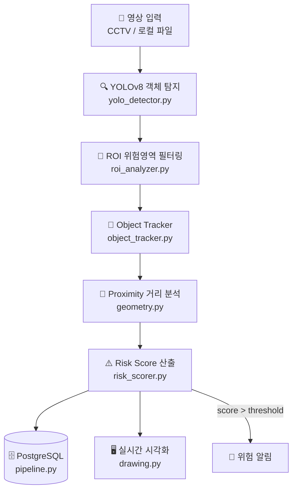

# 🚦 Smart Crosswalk Risk Analyzer

> YOLOv8 기반 실시간 차량-보행자 위험도 분석 시스템


<br>

## 📌 프로젝트 개요

횡단보도 CCTV 영상을 실시간으로 분석하여 차량·보행자 간 위험도를 정량적 점수로 산출하고,
위험 이벤트를 PostgreSQL에 저장하는 **End-to-End 분석 파이프라인**입니다.

| 항목 | 내용 |
|---|---|
| 📅 기간 | 2025.05.13 ~ 2025.05.26 (2주) |
| 👥 팀 구성 | 3인 팀 |
| 🙋 본인 역할 | DB 설계 · 데이터 파이프라인 구축 |

<br>

## 🏗 시스템 아키텍처



<br>

## ⚙️ 핵심 기능

### 1. YOLOv8 객체 탐지 (`src/detector/`)
- 모델: YOLOv8 (경량 모델로 실시간 처리 최적화)
- 탐지 클래스: `person`, `car`, `truck`, `bus`
- Confidence Threshold: `0.6`

### 2. ROI 기반 위험영역 분석 (`src/analyzer/`)
- 횡단보도 영역을 다각형 ROI로 정의
- ROI 내부 객체에 위험 가중치 적용

### 3. Object Tracking (`src/tracker/`)
- 프레임 간 동일 객체 ID 유지
- 연속적인 이동 궤적 및 속도 추정 가능

### 4. 위험도 점수 산출
```
Risk Score = (1 / proximity) × speed_factor × roi_weight
```
| 변수 | 설명 |
|---|---|
| `proximity` | 차량-보행자 픽셀 거리 |
| `speed_factor` | 프레임 간 객체 이동량 |
| `roi_weight` | ROI 내부 존재 시 1.5 가중치 |

### 5. PostgreSQL 데이터 파이프라인 (`src/database/`) ← 본인 담당
```sql
CREATE TABLE risk_events (
    id               SERIAL PRIMARY KEY,
    timestamp        TIMESTAMPTZ NOT NULL,
    risk_score       FLOAT       NOT NULL,
    vehicle_count    INT,
    pedestrian_count INT,
    min_proximity    FLOAT,
    frame_path       TEXT,
    created_at       TIMESTAMPTZ DEFAULT NOW()
);
-- 시계열 범위 쿼리 최적화
CREATE INDEX idx_risk_events_timestamp ON risk_events(timestamp);
```

<br>

## 👥 팀 역할 분담

| 이름 | 역할 | 담당 모듈 |
|---|---|---|
| 본인 | **DB 설계 · 데이터 파이프라인** | `src/database/`, `src/analyzer/roi_analyzer.py`, `scripts/` |
| 팀원 A | AI 모델 · 객체 탐지 | `src/detector/`, `src/tracker/` |
| 팀원 B | 시각화 · 유틸리티 | `src/utils/`, `config/` |

### 🙋 본인 기여 상세
- ✅ PostgreSQL 스키마 설계 및 인덱싱 전략 수립
- ✅ 위험 이벤트 실시간 저장 파이프라인 구현 (`db_pipeline.py`)
- ✅ ROI 영역 분석 로직 구현 (`roi_utils.py`)
- ✅ DB 초기화 스크립트 작성 (`scripts/setup_db.sql`)
- ✅ 환경변수 기반 설정 구조 설계 (`.env.example`)

<br>

## 🗂 디렉토리 구조

```
smart-crosswalk-risk-analyzer/
├── src/
│   ├── detector/
│   │   ├── __init__.py
│   │   └── yolo_detector.py       # YOLOv8 추론 파이프라인
│   ├── analyzer/
│   │   ├── __init__.py
│   │   ├── risk_scorer.py         # 위험도 점수 산출
│   │   └── roi_analyzer.py        # ROI 영역 분석
│   ├── tracker/
│   │   ├── __init__.py
│   │   └── object_tracker.py      # Object Tracking
│   ├── database/
│   │   ├── __init__.py
│   │   └── pipeline.py            # PostgreSQL 저장 파이프라인
│   └── utils/
│       ├── __init__.py
│       ├── geometry.py            # 거리 계산 유틸
│       └── drawing.py             # 시각화 유틸
├── config/
│   └── settings.py                # 환경변수 설정
├── tests/
│   ├── test_detector.py
│   ├── test_risk_scorer.py
│   └── test_database.py
├── docs/
│   └── images/                    # 아키텍처 다이어그램
├── scripts/
│   └── setup_db.sql               # DB 초기화 스크립트
├── .env.example                   # 환경변수 템플릿
├── .gitignore
├── requirements.txt
├── main.py
└── README.md
```

<br>

## 🚀 실행 방법

### 사전 요구사항
- Python 3.10+
- PostgreSQL 15+

### 설치 및 실행

```bash
# 1. 레포지토리 클론
git clone https://github.com/본인아이디/smart-crosswalk-risk-analyzer.git
cd smart-crosswalk-risk-analyzer

# 2. 패키지 설치
pip install -r requirements.txt

# 3. 환경변수 설정
cp .env.example .env
# .env 파일에 DB 정보 입력

# 4. DB 초기화
psql -U your_user -d crosswalk_db -f scripts/setup_db.sql

# 5. 실행
python main.py --source data/sample/test_video.mp4
```

<br>

## 🔧 기술적 의사결정

| 결정 | 선택 | 이유 |
|---|---|---|
| YOLO 모델 크기 | YOLOv8n (경량) | 실시간성 우선 — 정확도 소폭 손실 대신 처리속도 3배 향상 |
| DB 선택 | PostgreSQL | timestamp 인덱싱으로 TimescaleDB 없이 충분한 시계열 성능 확보 |
| 인덱스 전략 | BRIN → B-tree | 시계열 범위 쿼리 패턴에 최적화 |

<br>

## 📈 개선 방향

- [ ] Apache Kafka 기반 실시간 스트리밍 파이프라인 전환
- [ ] Apache Airflow로 배치 분석 스케줄링
- [ ] Grafana 연동 실시간 위험도 대시보드
- [ ] FastAPI REST API 래핑
- [ ] Docker Compose 환경 통일

<br>

## 🛠 Tech Stack

| 분류 | 기술 |
|---|---|
| Language | Python 3.10 |
| AI/Vision | YOLOv8 (Ultralytics), OpenCV |
| Database | PostgreSQL 15 |
| Config | python-dotenv |
