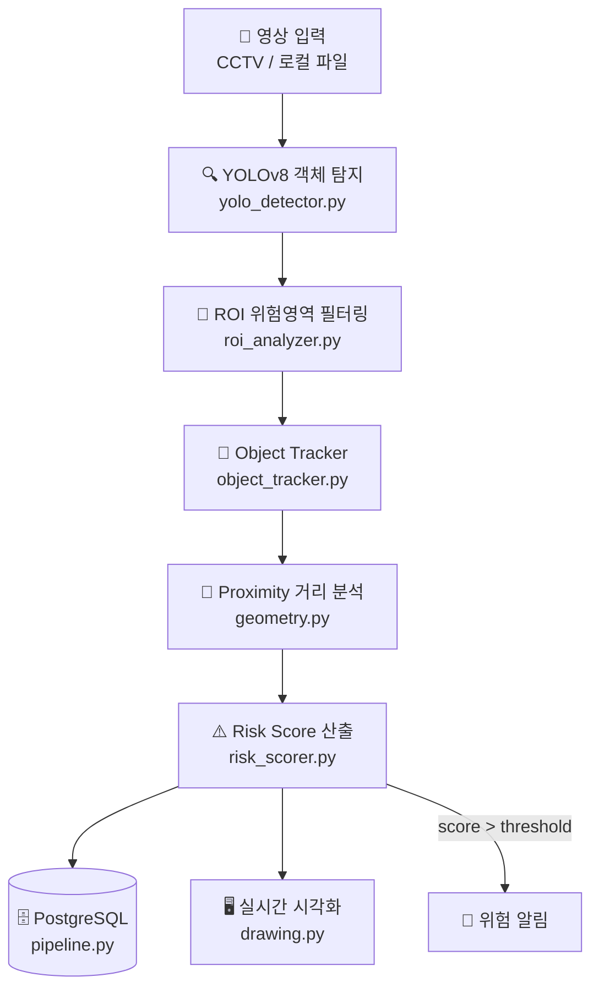

# 🚦 Smart Crosswalk Risk Analyzer

> YOLOv8 기반 실시간 차량-보행자 위험도 분석 시스템


<br>

## 📌 프로젝트 개요

횡단보도 CCTV 영상을 실시간으로 분석하여 차량·보행자 간 위험도를 정량적 점수로 산출하고,
위험 이벤트를 PostgreSQL에 저장하는 **End-to-End 분석 파이프라인**입니다.

| 항목 | 내용 |
|---|---|
| 📅 기간 | 2025.05.13 ~ 2025.05.26 (2주) |
| 👥 팀 구성 | 3인 팀 |
| 🙋 본인 역할 | DB 설계 · 데이터 파이프라인 구축 |
| ✅ 테스트 | 단위 테스트 43개 · GitHub Actions CI 자동화 |

<br>

## 🏗 시스템 아키텍처



<br>

## ⚙️ 핵심 기능

### 1. YOLOv8 객체 탐지 (`src/detector/`)
- 모델: YOLOv11s (실시간 처리 최적화)
- 탐지 클래스: `person`, `car`, `truck`, `bus`
- Confidence Threshold: `0.18` / IOU: `0.45`
- ByteTrack 트래커로 프레임 간 객체 ID 유지

### 2. ROI 기반 위험영역 분석 (`src/analyzer/`)
- 횡단보도·차량영역을 다각형 ROI로 마우스 직접 지정
- ROI 내부 객체에 위험 가중치 적용 (1.5x)
- 2개의 차량 ROI 독립 관리

### 3. Object Tracking (`src/tracker/`)
- `ObjectTracker` 클래스로 트래킹 상태 캡슐화
- `TrackState` 단위로 이동 감지·정지 카운트·궤적 관리
- 최근 30프레임 궤적 유지, 60프레임 미등장 시 자동 정리

### 4. 위험도 점수 산출 (`src/analyzer/risk_scorer.py`)

상황별 분기 조건으로 위험도를 동적으로 산출합니다:

| 상황 | 위험도 |
|---|---|
| 보행자·차량 동시 ROI 내 이동 | 80 이상 |
| 횡단보도에 보행자 + 차량 진입 | 100 |
| 횡단보도 보행자 + 차량 이동 | 60 이상 |
| 차량 장시간 정지 | 감소 (30 이하) |

점수는 급격한 변화 없이 프레임마다 ±4/±2로 부드럽게 수렴합니다.

### 5. PostgreSQL 데이터 파이프라인 (`src/database/`) ← 본인 담당

3가지 저장 전략을 독립적으로 운영합니다:

| 테이블 | 저장 조건 | 용도 |
|---|---|---|
| `risk_log` | 위험도 변화 ±10 이상 | 주요 변화 포인트 기록 |
| `risk_summary` | 매 1초 집계 | 시간대별 평균/최대 위험도 |
| `risk_event` | 위험도 60 이상 구간 | 위험 이벤트 시작~종료 추적 |

```sql
-- 위험 이벤트 구간 테이블 (핵심)
CREATE TABLE risk_event (
    id             BIGSERIAL PRIMARY KEY,
    session_id     TEXT        NOT NULL,
    started_at     TIMESTAMPTZ NOT NULL,
    ended_at       TIMESTAMPTZ,
    peak_risk      SMALLINT    NOT NULL DEFAULT 0,
    duration_sec   FLOAT,
    trigger_reasons TEXT[]
);
CREATE INDEX idx_risk_event_session ON risk_event (session_id, started_at);
```

<br>

## 👥 팀 역할 분담

| 이름 | 역할 | 담당 모듈 |
|---|---|---|
| 본인 | **DB 설계 · 데이터 파이프라인** | `src/database/`, `src/analyzer/roi_analyzer.py`, `scripts/` |
| 팀원 A | AI 모델 · 객체 탐지 | `src/detector/`, `src/tracker/` |
| 팀원 B | 시각화 · 유틸리티 | `src/utils/`, `config/` |

### 🙋 본인 기여 상세
- ✅ PostgreSQL 3-테이블 스키마 설계 및 인덱싱 전략 수립
- ✅ 위험 이벤트 실시간 저장 파이프라인 구현 (`pipeline.py`)
- ✅ risk_log / risk_summary / risk_event 3단계 저장 전략 설계
- ✅ ROI 영역 분석 로직 구현 (`roi_analyzer.py`)
- ✅ DB 초기화 스크립트 작성 (`scripts/setup_db.sql`)
- ✅ 환경변수 기반 설정 구조 설계 (`.env.example`)
- ✅ 단위 테스트 43개 작성 및 GitHub Actions CI 구축

<br>

## ✅ 테스트 현황

```
tests/
├── test_detector.py     # ROI 판별, proximity, 위험도 계산 (17개)
├── test_risk_scorer.py  # TrackState, ObjectTracker 상태 관리 (16개)
└── test_database.py     # 파이프라인 초기화, 저장 조건, 이벤트 추적 (10개)

총 43개 테스트 · 전체 통과 ✅
```

로컬 실행:
```bash
pytest tests/ -v
pytest tests/ -v --cov=src --cov-report=term-missing  # 커버리지 포함
```

GitHub Actions: `main` / `develop` 브랜치 push 및 PR 시 자동 실행

<br>

## 🗂 디렉토리 구조

```
smart-crosswalk-risk-analyzer/
├── .github/
│   └── workflows/
│       └── ci.yml                 # GitHub Actions CI
├── src/
│   ├── detector/
│   │   ├── __init__.py
│   │   └── yolo_detector.py       # YOLOv8 추론 파이프라인
│   ├── analyzer/
│   │   ├── __init__.py
│   │   ├── risk_scorer.py         # 위험도 점수 산출
│   │   └── roi_analyzer.py        # ROI 영역 분석
│   ├── tracker/
│   │   ├── __init__.py
│   │   └── object_tracker.py      # ObjectTracker / TrackState
│   ├── database/
│   │   ├── __init__.py
│   │   └── pipeline.py            # PostgreSQL 3단계 저장 파이프라인
│   └── utils/
│       ├── __init__.py
│       ├── geometry.py            # 거리 계산 유틸
│       └── drawing.py             # 시각화 유틸
├── config/
│   └── settings.py                # 환경변수 설정
├── tests/
│   ├── conftest.py
│   ├── test_detector.py
│   ├── test_risk_scorer.py
│   └── test_database.py
├── data/
│   └── sample/                    # 테스트 영상 (.gitignore 제외)
├── docs/
│   └── images/                    # 아키텍처 다이어그램
├── scripts/
│   └── setup_db.sql               # DB 초기화 (docker-compose 자동 실행)
├── .env.example                   # 환경변수 템플릿
├── .gitignore
├── docker-compose.yml             # PostgreSQL 컨테이너
├── pytest.ini
├── requirements.txt
├── main.py
└── README.md
```

<br>

## 🚀 실행 방법

### 사전 요구사항
- Python 3.11+
- Docker & Docker Compose

### 설치 및 실행

```bash
# 1. 레포지토리 클론
git clone https://github.com/s38827550-sys/smart-crosswalk-risk-analyzer.git
cd smart-crosswalk-risk-analyzer

# 2. 가상환경 생성 및 활성화
python -m venv .venv
# Windows
.venv\Scripts\activate

# 3. 패키지 설치
pip install -r requirements.txt

# 4. 환경변수 설정
cp .env.example .env
# .env 파일에 DB 정보 입력

# 5. DB 컨테이너 시작 (테이블 자동 생성)
docker-compose up -d

# 6. 실행 (DB 저장 포함)
python main.py --source data/sample/test_video.mp4

# DB 저장 없이 실행
python main.py --source data/sample/test_video.mp4 --no-log
```

<br>

## 🔧 기술적 의사결정

| 결정 | 선택 | 이유 |
|---|---|---|
| YOLO 모델 | YOLOv11s | 실시간성 우선 — 경량 모델로 CPU 환경에서도 안정적 처리 |
| DB 선택 | PostgreSQL | timestamp 인덱싱으로 TimescaleDB 없이 충분한 시계열 성능 확보 |
| 저장 전략 | 3-테이블 분리 | 변화 감지·집계·이벤트를 독립 관리하여 분석 목적별 최적화 |
| DB_CONFIG 초기화 | 지연 초기화 | 모듈 import 시점이 아닌 connect() 호출 시점에 환경변수 읽어 테스트 환경 분리 |
| 트래커 구조 | ObjectTracker 클래스 캡슐화 | 전역 딕셔너리 관리 → 상태 객체로 분리하여 테스트 가능성 확보 |

<br>

## 📈 개선 방향

- Apache Kafka 기반 실시간 스트리밍 파이프라인 전환
- Apache Airflow로 배치 분석 스케줄링
- Grafana 연동 실시간 위험도 대시보드
- FastAPI REST API 래핑
- Docker Compose 환경 통일
- 테스트 커버리지 80% 이상 달성

<br>

## 🛠 Tech Stack

| 분류 | 기술 |
|---|---|
| Language | Python 3.11 |
| AI/Vision | YOLOv11s (Ultralytics), OpenCV, ByteTrack |
| Database | PostgreSQL 15 |
| Testing | pytest, pytest-cov, GitHub Actions CI |
| Config | python-dotenv |